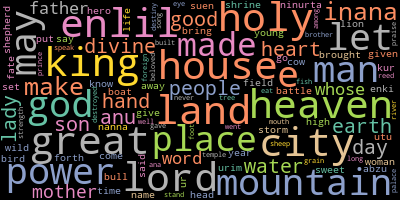

  

Word Cloud of top 1000 terms in all texts after removal of stopwords

# Ancient Texts in Translation

### Purpose
* To discover whether modern NLP tools and predictive algorithms can provide insights into ancient text corpora

### Questions to answer
* Will modern subjectivity and polarity evaluations align with ancient sensibilities?
* Will counts and weights either confirm known emphases or provide unexpected patterns?
* Will a supervised binary classification model be able to differentiate between genre of texts, texts featuring different gods, or featuring different persons?
* Will an unsupervised clustering model be able to differentiate between genre of texts, texts featuring different gods, or featuring different persons?

### Deliverables
This project has six project notebooks, two appendices, and two py files.\
Each notebook has an accompanying report.

### Notebook Highlights
#### *NLP section*
* **Notebook Part I: Extensive EDA**
>Cleaning, wrangling, statistical analyses, and visualizations of data set\
>An overview of the dataset's components accompanied by an analysis of the rationale behind specific transformations applied
  
* **Notebook Part II: Sentiment**
>Regex extensively employed to prepare text for analyses\
>Acquired scores with TextBlob and Vader\
>Aggregated results by genre and featured god
>Created visuals

* **Notebook Part III: Counts, Frequency, and Weights**
>Tokenized and lemmatized text for analysis using NLTK sent_tokenize, WordNetLemmatizer, and Regex\
>Calculated the word count for each feature (`word count`)\
>Compiled a dictionary of the top five words based on their frequency\
>Developed a dictionary of the top five weighted bi-grams\
>Created a dictionary of the top five weighted n-grams (3 to 4 words)\
>Aggregated data by genre, deity, and individual

* **Notebook Part IV: Balancing Data Set**
>Applied NLTK sent_tokenize function on `cleaned_text` to generate `sentence_count`\
>Created binary target variable `is_hymn` derived from `b_category`\
>Balanced data through minor recategorization\
>Employed Regex findall() to assess percentage of breaks in texts and eliminated problematic entries\
>Utilized Gensim to extract and summarize texts exceeding 1200 words\
>Produced `lemmatized_summaries` for further analysis using WordNetLemmatizer

#### *Machine Learning Section with Tokenization*
* **Notebook Part V: Random Forest and XGBoost models**
> Created hstack feature that includes new features: `top_word_freq`, `divine_power_count`, and `divine_power_weighted`\
> Collinearity Assessment: calculated VIF and generated a Pearson correlation coefficient matrix\
> Configured CountVectorizer to produce a feature matrix that captures 2-grams and 3-grams\
> Constructed a Random Forest model using both training and validation datasets\
> Developed an XGBoost model using both training and validation datasets\
> Assessed model performance: created confusion matrices, plotted ROC curves and calculated AUC scores, and plotted Precision-Recall Curve\
> Extracted feature importance metrics for both models\
> Evaluated the superior model using test data to assess its performance
     
* **Notebook Part V: K-means clustering model**
>Being built

#### *Appendices*
* **Appendix a: Word Clouds**
>Generated multiple word clouds by genre, god, and person with WordCloud

* **Appendix b: Hypothesis Testing**
>Performed 3 two-sample hypothesis tests (t-tests) using Scipy’s stats.ttest_ind() to ascertain if there is a statistically significant difference or a random sampling occurrence in means by target variable `is_hymn` and the features: `word_count`, `whole_polarity`, and `whole_subjectivity`

### What this is
An experiment using modern NLP tools and predictive algorithms on texts in translation

### What this is not
Foolproof. Each of these notebooks was built and run using translations of ancient texts. Translators may or may not have been consistent in word choice, or, conversely, too consistent in word choice when a different English word would have suited context better. Additionally, some of the texts are extremely fragmentary, thus many texts are missing words, phrases, or large chunks. Many of the texts are composites. In the data set, a single composition is given per observation. However, that single composition may have been pieced together from several exemplars of it. These exemplars are not always exact copies, so where one scribe may have used one term (or sign) to represent, say, "adoration", another may have chosen a different term (or sign). Since the compositions are then compilations, if both original terms are thought to mean generally "adoration," this is the selected English translation. This also means that if there is/was any differing nuance between the exemplars it has been removed.
